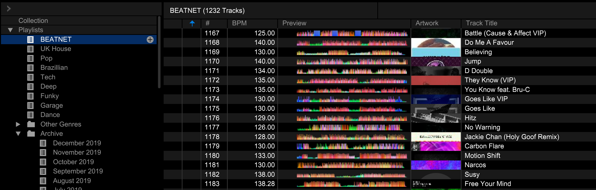
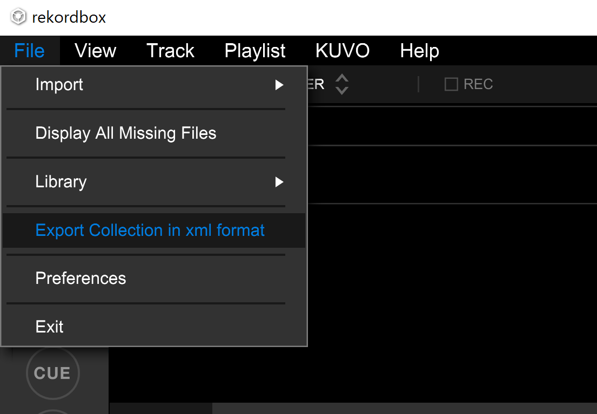
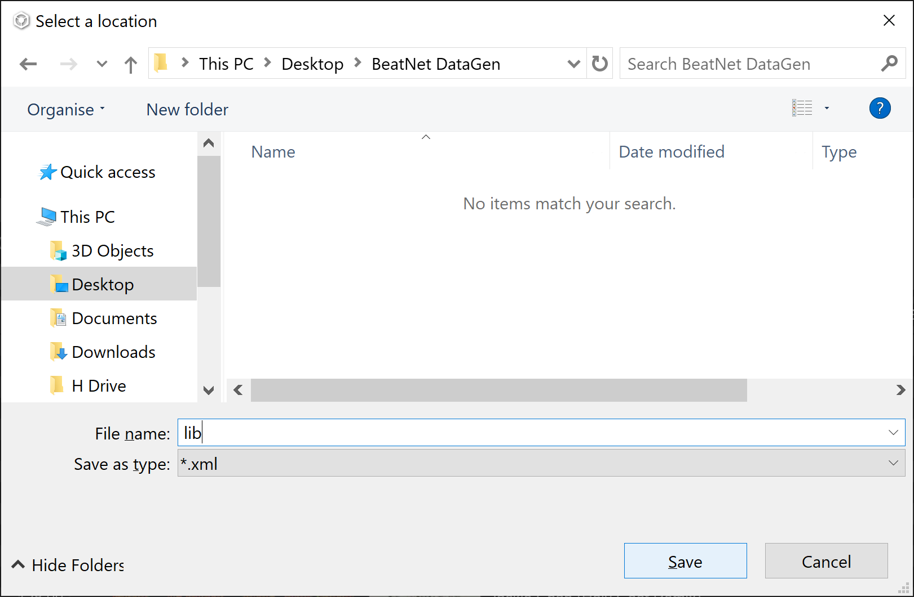
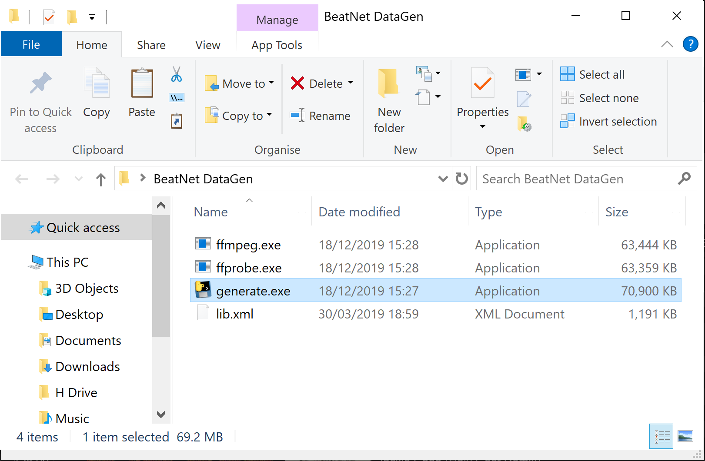
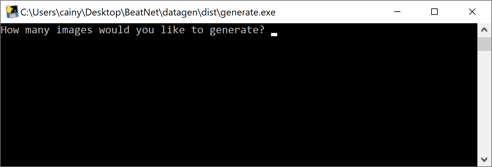

# BeatNet Training Data Generator

## Instructions For Use

1. Download the generator from [here](https://github.com/cainy393/BeatNet/releases/download/0.1/generator.zip) and extract the zip file to somewhere convenient such as the Desktop.

2. Open up your Rekordbox software, create a new playlist named "BEATNET" and add as many tracks as you can that meet the following criterea:
	- The BPM is accurate throughout the entire track. Only tracks with a constant, unchanging BPM throughout the entire track can be used.
	- There are no long periods of silence in the track (other than the first or last 5 seconds).
	- Selecting a broad range of BPMs is more important that selecting lots of tracks at the same BPM.

	

3. Once you have finished producing the playlist, go to **File > Export Collection in xml format** to export your library.

	

4. Save the file in the folder you extracted in step 1 as **lib.xml**

	

5. Run **generate.exe** located inside the the folder extracted in step 1, you should see the **lib.xml** file there from the previous step too.

	
	
6. After a short wait, you should see a window like the one shown below. It will probably take around 30 minutes to finish running, possibly even longer.

	

7. Once the generator has finished the window will close and you should see a new directory named **specgrams** in the folder from earlier. This is the generated data, you should zip up this folder before sending it.

## Advanced Options

You can run the generator from the command line in order to configure the location of the library file and the number of training images to produce. To do so first press **Windows Key + R** to open the run dialogue. Now type **cmd** into the text box and hit enter. Navigate to the working directory using the following command:

    > cd "C:/Users/cainy/Desktop/BeatNet DataGen"
	
Don't forget to change the directory location shown above to wherever you extracted the zip file from step 1.

Now, to run the generator, simply use the following command, changing the values according to your needs.

    > ./generator.exe lib.xml 1000
	
## Running From Source

If you wish to run the non-compiled version of this script from the source code you can follow these instructions. You should first install Python 3.6 from [here](https://www.python.org/downloads/release/python-369/).

1. Clone the repo to your local workspace and navigate to the datagen directory.

```bash
$ git clone https://github.com/cainy393/BeatNet.git
$ cd BeatNet/datagen
```
	
2. Install the dependencies using pip.

```bash
$ pip install -r requirements.txt
```
	
3. Install ffmpeg by downloading the binaries from [here](https://ffmpeg.zeranoe.com/builds/), extract the archive and copy the **ffmpeg.exe** and **ffprobe.exe** from the bin directory to the `BeatNet/datagen` directory within this repo.
	Alternatively you can install them the regular way, adding the bin directory to your system PATH. This will cause the build script to fail, however.
	
4. Run the `generate.py` script.

```bash
$ python generate.py [library_location] [images_to_produce]

# Default values...
$ python generate.py lib.xml 1000
```